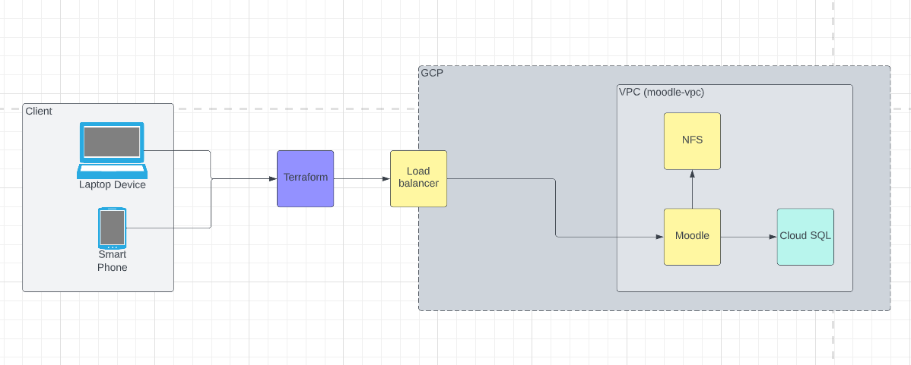
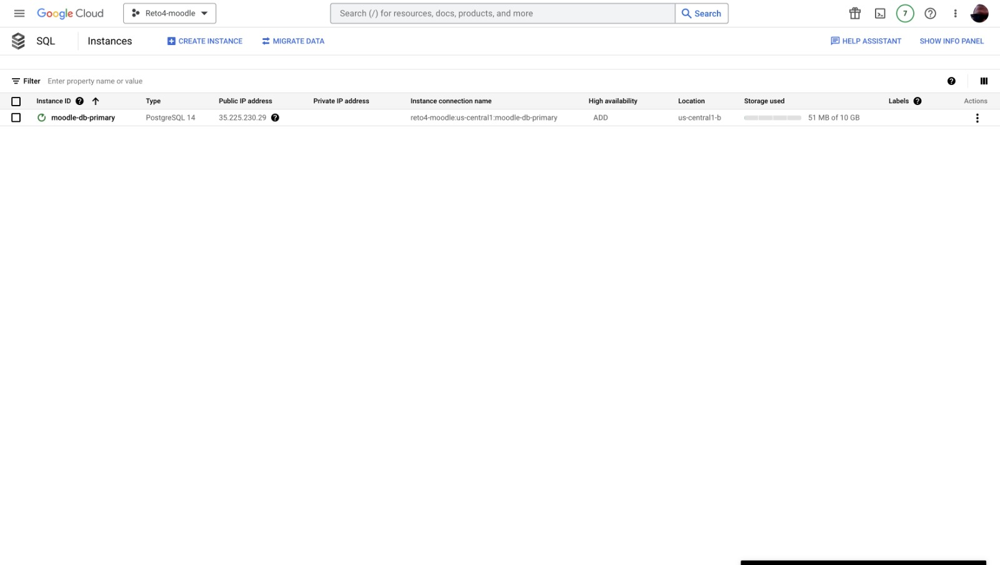
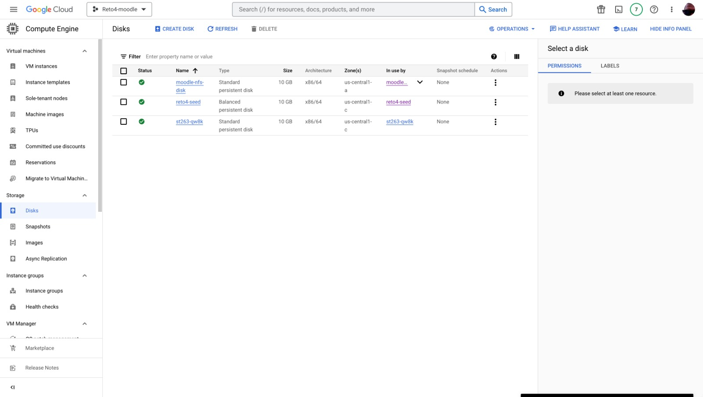
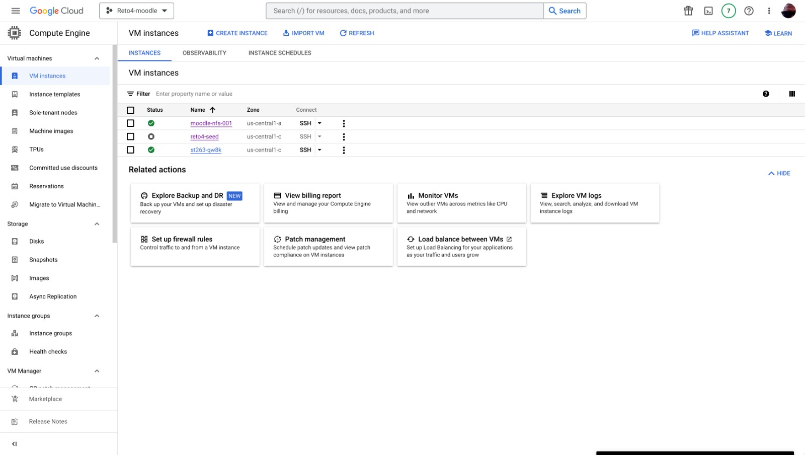
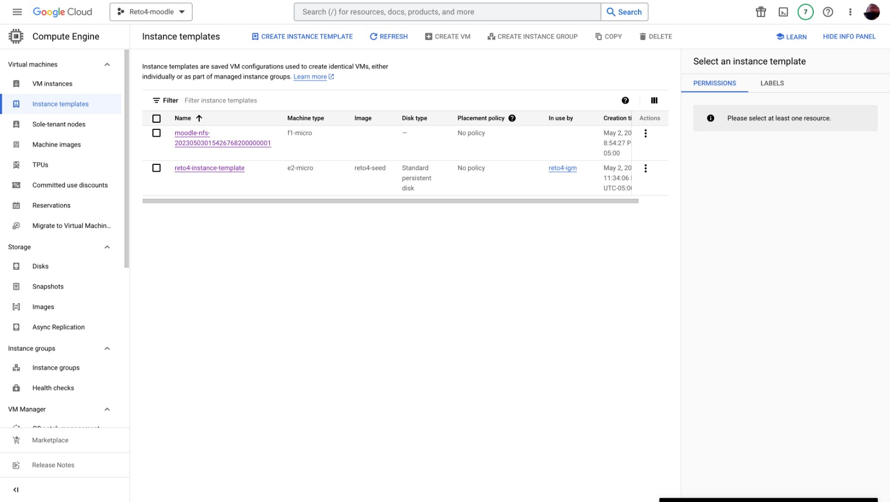
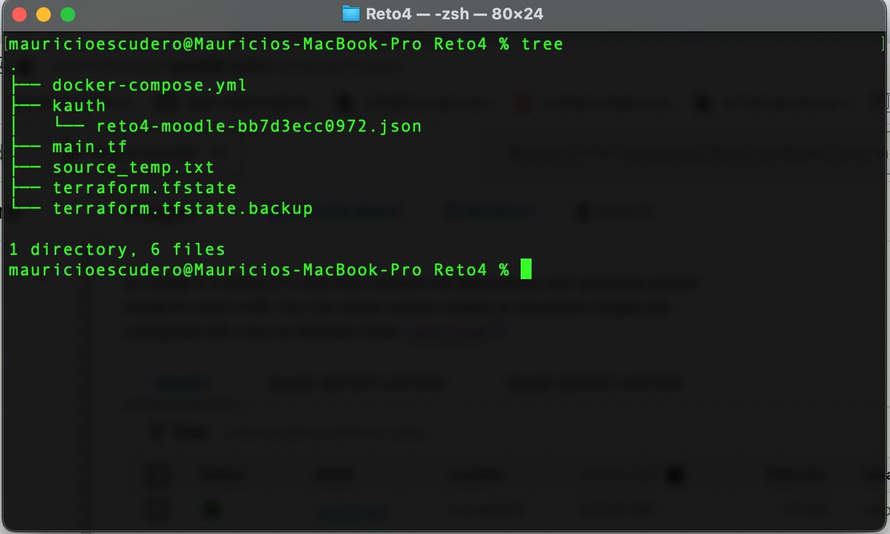

# ST0263 Tópicos Especiales en Telematica

# Estudiantes: 
- Mauricio Escudero, mescude1@eafit.edu.co
- Jose Alejandro Sánchez Sánchez, jasanchez@eafit.edu.co
- Edison Alejandro Torres Muñoz, eatorresm@eafit.edu.co
#
# Profesor: Edwin Nelson Montoya Munera, emontoya@eafit.edu.co

# Proyecto 2
#
# 1. Breve descripción de la actividad
Desplegar una aplicación open source LAMP de comunidad que represente un sistema de
información del tipo Sistema de Gestión de Aprendizaje y para eso se selecciono Moodle.
#
# 1.1. Que aspectos cumplió o desarrolló de la actividad propuesta por el profesor (requerimientos funcionales y no funcionales)

# 1.2. Que aspectos NO cumplió o desarrolló de la actividad propuesta por el profesor (requerimientos funcionales y no funcionales)

Todos los requerimientos fueron implementados.

# 2. Información general de diseño de alto nivel, arquitectura, patrones, mejores prácticas utilizadas.

La arquitectura descrita tiene un cliente que envía solicitudes HTTP a través de Internet. Terraform se utiliza para describir y configurar la infraestructura de GCP, que incluye la creación de recursos como instancias de máquinas virtuales, redes y equilibradores de carga. El equilibrador de carga distribuye el tráfico entre las instancias de la aplicación web que se ejecutan en GCP. La aplicación web está creada con Moddle y utiliza NFS para compartir datos entre las instancias. Por último, la base de datos de la aplicación web se aloja en Cloud SQL.

A continuacion se explicara cada uno y su relacion en la arquitectura:
- *Cliente:* Es el usuario final que interactúa con la aplicación web. El cliente envía solicitudes HTTP a través de Internet.

- *Terraform:* Es una herramienta de infraestructura como código que permite a los desarrolladores definir y administrar su infraestructura en la nube de forma programática. En este caso, Terraform se utiliza para describir y configurar la infraestructura de GCP, lo que incluye la creación de recursos como instancias de máquinas virtuales, redes y equilibradores de carga.

- *Load balancer:* Es un servicio que distribuye el tráfico de entrada entre varias instancias de la aplicación. En este caso, se utiliza un equilibrador de carga para distribuir el tráfico entre las instancias de la aplicación web que se ejecutan en GCP.

- *Moodle:* Es un software de gestión del aprendizaje que se utiliza para crear cursos en línea y contenido educativo.

- *NFS:* Es un protocolo de sistema de archivos de red que permite a los usuarios acceder y compartir archivos y directorios de forma remota. En este caso, se utiliza NFS para compartir datos entre las instancias de la aplicación web.

- *Cloud SQL:* Es un servicio de bases de datos relacionales completamente administrado en la nube que se utiliza para alojar la base de datos de la aplicación web.

# 3. Descripción del ambiente de desarrollo y técnico: lenguaje de programación, librerias, paquetes, etc, con sus numeros de versiones.

# 3.1. Como se compila y ejecuta.

# 3.2. Detalles del desarrollo.

# 3.3. Detalles técnicos

# 3.4. Descripción y como se configura los parámetros del proyecto (ej: ip, puertos, conexión a bases de datos, variables de ambiente, parámetros, etc)
A continuacion se mostrarán las instancias que se tienen en GCP:

- SQL

- DISK

- Group

- Virtual Machines Instances

- Load balancer

- Templates

# 3.5. Detalles de la organización del código por carpetas o descripción de algún archivo. (ESTRUCTURA DE DIRECTORIOS Y ARCHIVOS IMPORTANTE DEL PROYECTO, comando 'tree' de linux)

# 4. Descripción del ambiente de EJECUCIÓN (en producción) lenguaje de programación, librerias, paquetes, etc, con sus numeros de versiones.

- Terraform: Terraform es una herramienta de infraestructura como código (IaC) que permite a los usuarios describir y gestionar la infraestructura de sus aplicaciones de manera declarativa. En lugar de crear y configurar manualmente los recursos de la infraestructura en la nube, los usuarios pueden definirlos en un archivo de configuración de Terraform y aplicar los cambios con un solo comando. Además, Terraform proporciona una interfaz para interactuar con los servicios y recursos de GCP, lo que permite a los usuarios definir su infraestructura en términos de recursos de GCP y gestionarlos de manera consistente y escalable. Con Terraform, los usuarios pueden crear y administrar fácilmente sus recursos de GCP, como instancias de máquinas virtuales, redes y bases de datos, entre otros.

Sabiendo ya que es Terraform, se utilizó un Script en el cual se ejecuta el init y terraform crea las instancias y las configura, terraform evita algunos trabajos, sin embargo, hay que hacer unas configraciones manuales para el proyecto.

# IP o nombres de dominio en nube o en la máquina servidor.

## descripción y como se configura los parámetros del proyecto (ej: ip, puertos, conexión a bases de datos, variables de ambiente, parámetros, etc)

## como se lanza el servidor.

## una mini guia de como un usuario utilizaría el software o la aplicación

## opcionalmente - si quiere mostrar resultados o pantallazos 

# 5. otra información que considere relevante para esta actividad.

# referencias:
