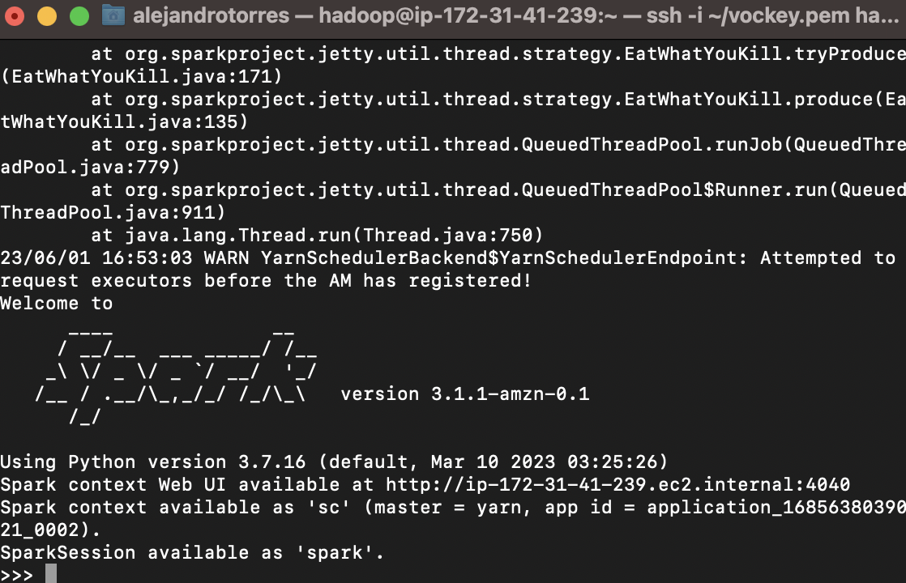
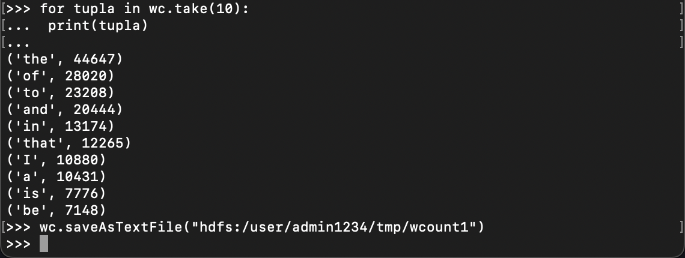
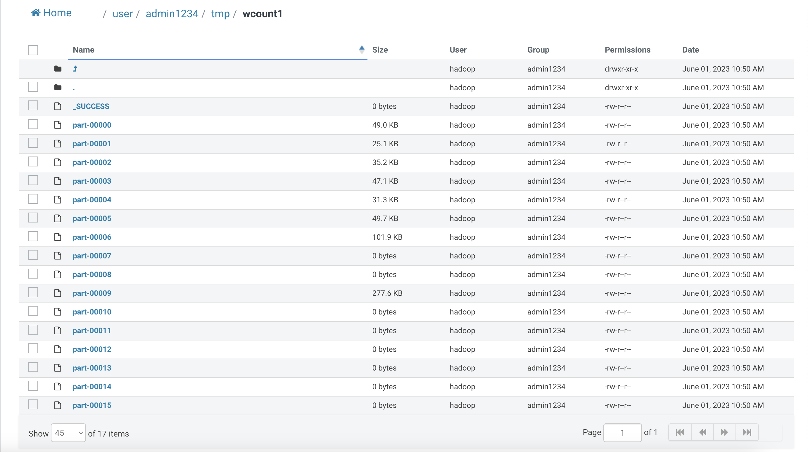
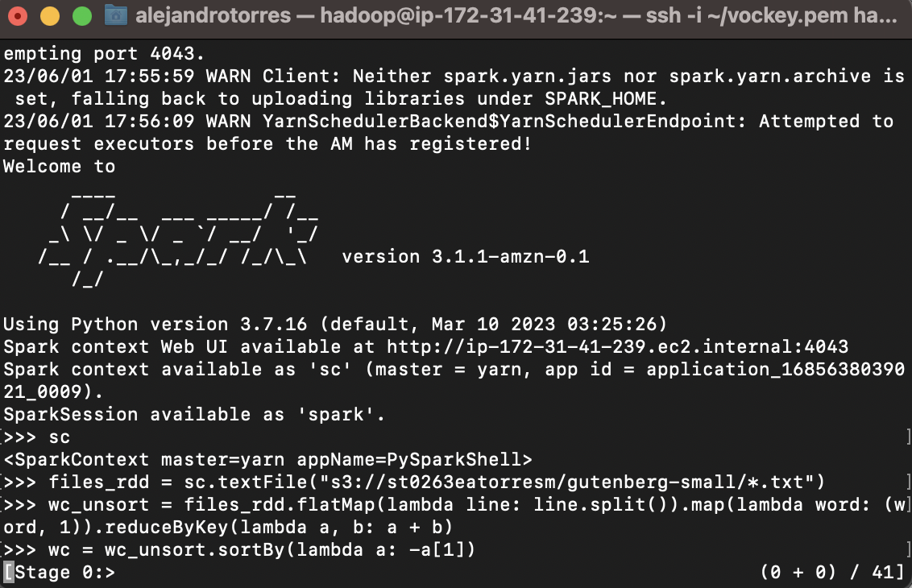
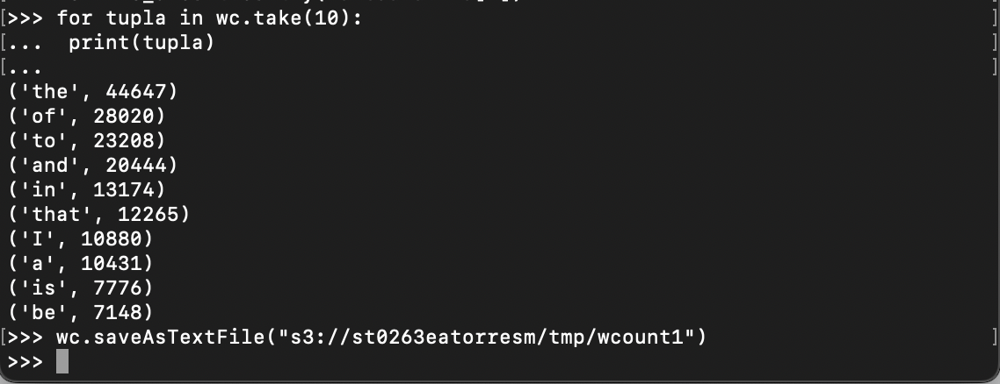
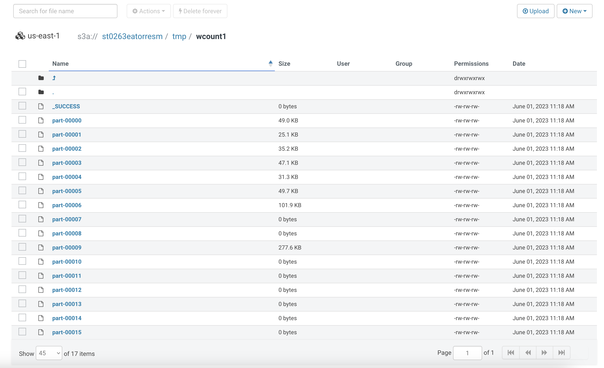
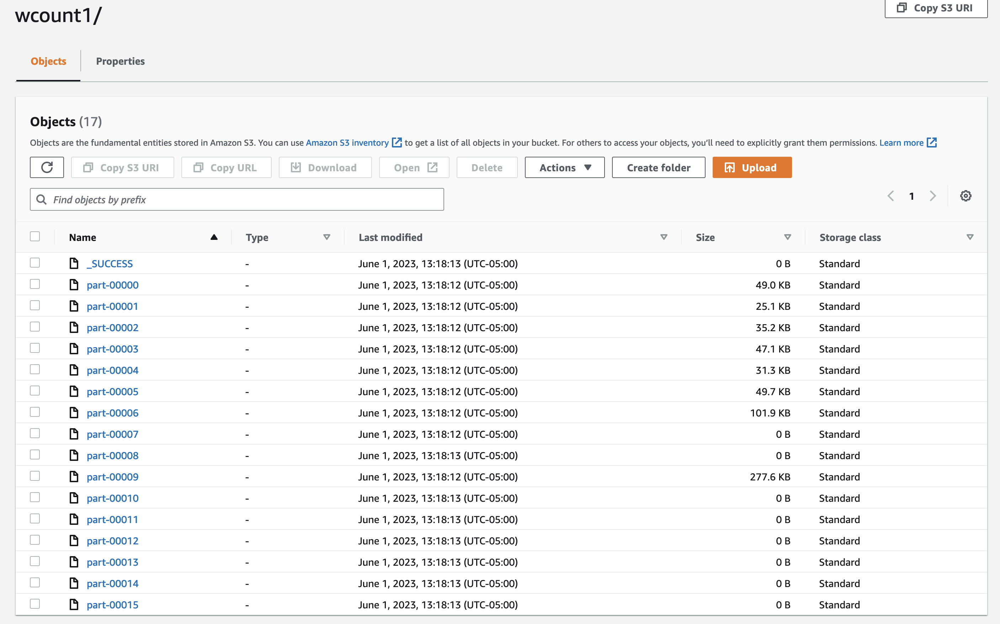
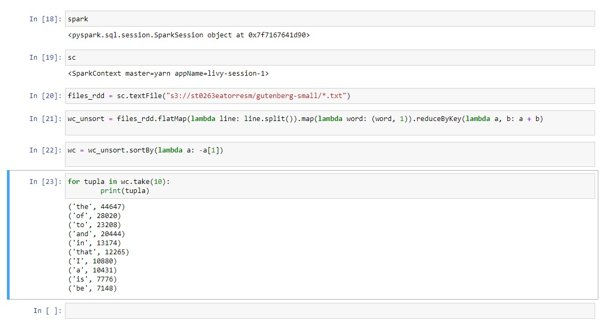

# Info de la materia: ST0263 Topicos Especiales en Telematica

# Estudiantes:
- Alejandro Torres Muñoz, eatorresm@eafit.edu.co
- Jose Alejandro Sánchez Sánchez, jasanchez@eafit.edu.co

# Profesor: Edwin Nelson Montoya, emontoya@eafit.brightspace.com

# Reto 5, 5.3.2 - Wordcount en Apache Spark AWS EMR

# Descripcion de la actividad

Ejercicios básicos de MapReduce en EMR con Spark.

## Que aspectos cumplió o desarrolló de la actividad propuesta por el profesor (requerimientos funcionales y no funcionale)

1. Ejecutar el wordcount por linea de comando 'pyspark' INTERACTIVO en EMR con datos en HDFS vía ssh en el nodo master.

2. Ejecutar el wordcount por linea de comando 'pyspark' INTERACTIVO en EMR con datos en S3 (tanto de entrada como de salida)  vía ssh en el nodo master.

3. Ejecutar el wordcount en JupyterHub Notebooks EMR con datos en S3 (tanto datos de entrada como de salida) usando un clúster EMR.

4. Ejecutar el notebook Data_processing_using_PySpark con datos desde S3

5. Explicar el notebook: Funcionamiento y salida.

## Que aspectos NO cumplió o desarrolló de la actividad propuesta por el profesor (requerimientos funcionales y no funcionales)

Todos los requerimientos fueron empleados.

# Descripcion del ambiente de ejecucion

- AWS EMR 6.3.1
- Ubuntu 22.04
- Spark
- ssh

# Ejecucion de la actividad

1. Debemos crear como primera instancia nuestro clúster, o en su defecto, clonarlo.

2. Conectarnos a través de ssh a la instancia del clúster.

3. Revisar que los archivos (deberían) s3 se encuentren, al igual montar nuevamente los archivos en HDFS (recordando que estos son temporales).

## 1. Wordcount interactivo con HDFS

1. Verificamos que los archivos temporales se encuentren.
2. Dentro de la instancia ssh EMR, nos conectamos a pyspark.
2. Ejecutamos línea por línea, los pasos que se entregan en el wordcount.

Nota: Se observan el output en la linea del print que muestra las palabras asociadas a sus cuentas. Observemos que el input está en hdfs en la carpeta user/admin1234/gutenberg-small, tomando todos los archivos txt con el operador wildcard y finalmente salvando el archivo en $USER/tmp/wcout1.

## Diferencia con MRJob

A diferencia con MRJob, corremos funciones que son aplicadas directamente sobre los archivos leidos en memoria. De igual forma, ya estos son finalmente parte de sc.

- flatMap: Se aplica función sobre líneas (Se splitea)
- map: Se aplica función sobre los objetos (mapeo de cada palabra con 1)
- reduceByKey: Reducción de objetos dados bajo una función (función anónima que dada dos entradas las suma y las devuelve).
- sortBy: Se orgniza bajo criterio (dado un par (tupla), se reversa en el - bajo el segundo elemento a[1]).
- take: Se toma muestra de todo el output.

## HUE

Dentro de HUE podemos revisar que la carpeta tmp/wcout1 existe y tiene los mismos archivos vistos por consola.

## 2. Wordcount interactivo con S3

1. Verificamos que los archivos S3 se encuentren.
2. Dentro de la instancia ssh EMR, nos conectamos a pyspark.
2. Ejecutamos línea por línea, los pasos que se entregan en el wordcount. 
(Lo mismo de los pasos anteriores)

Nota: Se observan el output en la linea del print que muestra las palabras asociadas a sus cuentas. Observemos que el input está en hdfs en la carpeta user/admin1234/gutenberg-small, tomando todos los archivos txt con el operador wildcard y finalmente salvando el archivo en $USER/tmp/wcout1.

## HUE / S3 AWS

### HUE

### AWS

Dentro de HUE o en el apartado de S3 de AWS, podemos revisar que la carpeta tmp/wcout1 existe y tiene los mismos archivos vistos por consola.

# 3. Wordcount Jupyter S3

# 4.  Explicacion del notebook `Data_processing_using_PySpark`

- Este código nos muestra cómo manipular datos (datasets, etc.) utilizando PySpark en el kernel de Jupyter.
- Realizamos las manipulaciones de datos de manera similar a como se hace con scipy, pandas o numpy, pero todo a través de PySpark.
- Exploramos diversas formas de agregar, eliminar y derivar columnas, así como de encontrar medidas de centralización, etc. Además, se encuentra disponible una explicación detallada línea por línea en el mismo directorio de este notebook en Jupyter.

Finalmente, el resultado del notebook creado se puede encontrar persistido en S3.

# Referencias

[Enunciado del proyecto](https://github.com/st0263eafit/st0263-231/blob/main/bigdata/lab5-3-mrjob-spark.txt)
